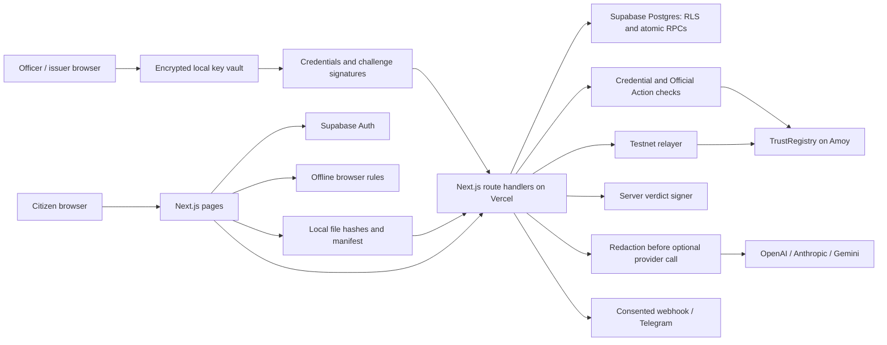

# SatyaCall — Prove, Protect, Preserve

A verification layer against impersonation and digital-arrest scams in India. **Verified identity is not permission to demand money.** SatyaCall checks both who contacted you and whether that specific request was authorized.

## Problem

A caller can claim to represent the police, a bank or another institution, create fear of arrest, isolate a person from family and demand an urgent transfer. A familiar logo, name or phone number is weak evidence. Even a genuine officer can make an unauthorized request. People need a clear verification path, time to pause and a way to preserve what happened.

## Solution

- **Prove:** approved institutions issue signed officer credentials; citizens challenge a caller, and the server checks identity plus a pre-registered Official Action.
- **Protect:** browser rules flag pressure and payment tactics in English, Hindi/Hinglish and Tamil/Tanglish; optional redacted LLM analysis adds context. Guardian alerts and a simulated UPI cooling-off screen provide support and friction.
- **Preserve:** the Evidence Vault hashes files locally, anchors a manifest hash and generates a printable complaint **draft** for manual filing.

Start at `/pressure` (**Someone is pressuring me**) for lookup → analysis → official verification, or `/demo` for a 90-second synthetic scenario. Other paths: `/verify`, `/analyze`, `/live-assist`, `/registry`, `/issuer`, `/root`, `/officer`, `/guardian`, `/vault`, `/evidence/verify`, `/dashboard`, `/login`. Pages support **en/hi/ta**, large verdict text and visible execution-mode labels.

Implemented locally: contract, browser key custody, onboarding, intent-bound verification/receipts, analyzer, hash registry, Guardian, Evidence Vault, dashboard and demo. Hosted Supabase/Vercel/Amoy deployment remains an operator step; no hosted success is claimed.

## Architecture

Next.js App Router + TypeScript + Tailwind on Vercel; Supabase Postgres/Auth with SSR sessions; Solidity 0.8.24 + Hardhat + ethers v6 on Polygon Amoy. Zod validates requests/model responses; Vitest and embedded PostgreSQL exercise libraries/APIs/RLS.



DB stores public keys/credentials, actions, single-use challenges, audits, report hashes, evidence metadata and alert state. Chain publishes issuer status and report/evidence anchors. Unlocked institution/officer keys and raw evidence files stay in the browser. Consented analyzer text reaches the API for redaction; the rules-only path sends no transcript.

## Verification flow

1. At `/issuer`, a user generates/encrypts a browser wallet and submits an institution application with its public address. Status starts pending. A DB-authorized root reviews it, registers the issuer through the relayer and records the transaction.
2. The officer **submits an application** from `/officer` with a browser-generated public address. An active institution's issuer admin reviews it, issues a credential signed in-browser, and can revoke it. Account roles come from `profiles`, never client metadata.
3. Before calling, the officer registers an Official Action: purpose, case reference, validity at most 24h, payment permission, amount cap and an institution-allowlisted payee. Sensitive purposes need issuer-admin maker-checker approval.
4. The citizen enters claimed entity/category, purpose, amount and payee. `/api/challenge` creates a six-digit code and UUID with a two-minute DB expiry, five-attempt limit and single-use state.
5. The officer console resolves and **shows the claimed entity and request before signing**. The active v3 signed message is exactly `challengeId|code|actionId`; its challenge ID refers to the immutable DB intent. The citizen pastes/scans the response token. This replaces the earlier v1 identity-only message format.
6. `/api/verify` checks the officer signature, issuer-signed credential, DB expiry/revocation/suspension, issuer `isActive` on-chain, challenge state and action approval/expiry/ownership. It compares category, purpose, amount and payee. Any off-allowlist payee is unauthorized. Consumption, fresh DB checks and audit completion use atomic SQL functions.
7. The response contains a reason and signed receipt: **VERIFIED_AUTHORIZED**, **IDENTITY_VERIFIED_NOT_AUTHORIZED**, or **NOT_VERIFIED**. Category mismatch is a warning/authorization failure. Receipt facts bind the challenge, action, officer, request, verdict and time; clients pin the public signer. Authorization applies only to those facts and validity, not every future request.

Every begun attempt gets an audit row, including failed signatures, replay, expiry and exhausted attempts. Rejected request envelopes/configuration failures are also logged when the DB is available. Reports tied to verified officers auto-flag them; the configured number of distinct reporters auto-suspends pending review.

## Security model

**Key custody.** Institution/officer wallets use browser `Wallet.createRandom()`. WebCrypto derives an AES-256-GCM key using PBKDF2-SHA-256 (310,000 iterations), a random salt and IV, and a 12+ character passphrase. Only ciphertext persists in account-scoped localStorage/backups; unlocked keys live in browser memory. APIs receive public addresses, credentials and signatures, never these private keys. Losing a key/passphrase has no server recovery. Browser compromise/XSS while unlocked remains a risk.

The operator holds two distinct signing keys: a low-balance **Amoy relayer** and a **verdict receipt signer**. Service-role, relayer, receipt, peppers, provider and Telegram/webhook secrets remain server-only. Public Supabase anon credentials are safe only with correctly applied RLS. `.env*` is ignored; build asset scans check secret names and configured values.

**Authorization/RLS.** All **17 public application tables** enable RLS with explicit policies. Route handlers re-check DB-derived roles before privileged writes; critical mutations are service-only atomic RPCs. Clients cannot promote roles or alter challenge attempts, verdicts or chain state. Dashboard scope comes from the authenticated DB role. DB UPSERT counters enforce serverless rate limits; untrusted forwarded headers cannot create fresh buckets. Zod, bounded JSON bodies, generic errors, nonce CSP, frame denial and same-origin API checks protect request boundaries.

**Relay-attack mitigation.** The officer reviews the citizen's entity and intent; signatures reference the challenge and action; challenges expire quickly, have five attempts and are single-use. Purpose/payee/amount must match the approved action. Pinned receipts bind the displayed outcome. These reduce relay risk but do **not** prove physical presence, authenticate a voice channel or defeat every live social-engineering relay. Independently contact the institution when uncertain.

**Privacy/accountability.** Phone → E.164, UPI → lowercase, wallet → checksum; `idHash = keccak256(normalized + REGISTRY_PEPPER)`. Raw reported identifiers are not stored in scam-report rows or on-chain. One report per reporter/hash, account-age eligibility and distinct-reporter thresholds reduce abuse; reports remain allegations, not proof of fraud. Low-entropy IDs can still be brute-forced if the pepper leaks. Evidence anchors prove hash consistency, not truth or legal admissibility. See the [security audit](docs/security-audit.md) for tested controls and operational gaps.

## Hybrid analyzer

Always run weighted deterministic rules first: authority impersonation, arrest threats/digital arrest, urgency, isolation, payment/safe-account demands, credential requests and suspicious links. Native and Latin-script Hindi/Tamil patterns include preventive-message handling and hard flags. The browser path works offline; Live Assist warns when browser speech recognition may use cloud processing.

Optional server analysis requires consent. It masks phones, account/card numbers, Aadhaar-like IDs and emails **before** a provider call. A real provider runs only for scores 20–80 or non-English/transliterated text. Delimited transcript text is untrusted, the model gets no tools, and strict JSON is validated with zod. Timeout: 8s per attempt, one retry. Invalid output/unavailability gives explicit `heuristics-fallback`.

For heuristic score H and model score L, final score is `max(H, round(0.4H + 0.6L), hardFlag ? 90 : 0)`. Hard flags cannot be downgraded. Scores are risk indicators, not probabilities. UI modes: `heuristics`, `hybrid`, `heuristics-fallback`, with latency. A one-hour DB cache uses SHA-256 of normalized input and excludes profile-owned rows; raw transcripts are not saved by the current analyzer. `LLM_PROVIDER=mock` needs no key and skips live provider calls.

### Synthetic benchmark

Run `npm --prefix web run benchmark`. The checked-in set contains **60 synthetic samples: 40 scam and 20 legitimate**, including code-mixed and tricky preventive/bank/OTP/courier messages. Positive means HIGH/score ≥70.

| Mode | Accuracy | Precision | Recall | False-positive rate | TP/TN/FP/FN |
| --- | ---: | ---: | ---: | ---: | --- |
| Heuristics only | 100.0% | 100.0% | 100.0% | 0.0% | 40 / 20 / 0 / 0 |
| Hybrid — deterministic mock simulation | 100.0% | 100.0% | 100.0% | 0.0% | 40 / 20 / 0 / 0 |

These are regression results on a small curated set, **not real-world accuracy or an independent LLM evaluation**. The mock reuses rules (34 hybrid-routed, 26 heuristics); paid-provider outputs may differ. No-key benchmark runs use mock simulation. For a fresh comparison, set a real provider, model and key locally, then rerun; transcripts are redacted and calls may incur provider charges.

## Six-step setup

Exact PowerShell commands, SQL, every Production/Preview variable, Auth redirects and smoke criteria are in the [deployment runbook](docs/deployment.md). Target plan: **Pro + Fluid Compute**; `/api/analyze` uses Node runtime and a 60s route cap with at most 16s of provider retries, below that cap. [Vercel duration reference](https://vercel.com/docs/functions/configuring-functions/duration).

1. **Prepare:** Node 24; `npm --prefix contracts ci`; `npm --prefix web ci`; copy `.env.example` to root `.env`; generate/protect operator keys and stable peppers.
2. **Supabase:** apply all migrations through `20261004000500_security_audit.sql`; verify RLS; create/confirm your account and promote its exact UUID via trusted SQL to `root_authority`.
3. **Amoy:** fund the test-only relayer with test POL; configure HTTPS RPC/`CHAIN_ID=80002`; run `npm --prefix contracts run deploy:amoy`; retain generated `web/lib/contract.json` and address/explorer link.
4. **Vercel:** root `web`, Node 24, Pro/Fluid enabled; set every required app variable in **Production + Preview** using matching isolated infrastructure; redeploy both scopes. Never public-prefix secrets.
5. **Auth + demo:** allow exact deployed `/auth/callback` URLs. Only on an isolated synthetic demo DB, run `seed:demo`, generate institution/officer keys in hosted `/demo`, then reseed with the **public** fixture. Configure a consented test Guardian.
6. **Validate:** `/api/health` must report DB/chain true; run rehearsal and connected demo, two-window verification, role/receipt/replay checks, and CI/local lint/tests/build/bundle scan. Record actual deployment evidence.

For localhost, set Supabase's allowed redirect to `http://localhost:3000/auth/callback`; use `npm --prefix web run dev`. Run `npm --prefix contracts run node` in a separate terminal, then `npm --prefix contracts run deploy:local` with `RPC_URL=http://127.0.0.1:8545` and `CHAIN_ID=31337`. Amoy Vercel deployment needs a reachable RPC; your computer's localhost is not reachable from Vercel.

**Deployment record:** Vercel URL: not recorded. Amoy address/explorer: not recorded; fill with your confirmed deployment. Current generated contract JSON may describe localhost and must be regenerated/configured for Amoy.

## Demo accounts and scenario

Only after seeding an isolated test project:

| Login | Role |
| --- | --- |
| `citizen@demo.satyacall.invalid` | citizen |
| `officer@demo.satyacall.invalid` | officer |
| `issuer@demo.satyacall.invalid` | issuer_admin |
| `root@demo.satyacall.invalid` | root_authority |

Fresh default password: **`SatyaCall-Demo-Only-2026!`**. `DEMO_PASSWORD` can override it locally; existing passwords are preserved. These deliberately public, confirmed accounts include a privileged root: never seed them into real-user production; disable/remove them after judging. Your own root account is promoted separately.

`/demo` has a Next-step scenario: fake CBI call → HIGH risk → Guardian alert → fake fails → separate legitimate information officer passes → synthetic number reported/anchored. Rehearsal is zero-setup and labels simulated DB/Guardian/chain state; it does not count as live verification or dashboard activity. Connected mode uses real API audits/receipts and confirmed Amoy transactions, and requires the original browser-held officer key. Official actions last 23h; refresh by reseeding the same public fixture before judging. See [connected demo instructions](docs/demo.md) and [Guardian/n8n workflow](docs/guardian-setup.md).

## Why blockchain and not just a database?

A database alone can implement the application and would be simpler, cheaper and easier to operate. Blockchain adds an independently inspectable issuer-status/anchor ledger shared across institutions, without requiring every observer to trust our API's presentation. Evidence manifest anchors establish publication of a hash; they do not prove the contents truthful or show when files were created.

The root still decides which institutions deserve trust, and the current contract has a single operator owner. Chain consensus does not make that decision honest, stop stolen keys or reveal an officer's intent. Postgres remains essential for roles, approved actions, challenges, revocation details, audit history and abuse controls. Chain outages cause verification to fail closed; writes cost gas and require reconciliation. Relayed DB report keys are idempotent, but permissionless public-wallet chain reports are not equivalent to distinct verified human reporters. A production system might instead use a signed transparency log; blockchain is justified only if shared independent inspection warrants its operational cost.

## Limitations

- This is a tested prototype/testnet deployment path, not a production certification. Hosted deployment, live policy drift, email delivery and Amoy readiness must be checked by the operator.
- No live call-audio access, on-device ML, real UPI interception, W3C VC compliance, court-admissibility guarantee or automatic complaint filing. `/upi-guard` is a simulated UX; real integration requires UPI-app/bank cooperation. Complaint drafts are template-based; optional LLM polishing remains future work.
- Credentials/actions prove institutional attestation, not universal legitimacy. Insider abuse, live relay attacks, stolen/unlocked browser keys and compromised root/receipt/relayer operators remain risks.
- Public demo privileged accounts are unsafe alongside real users. Mock benchmark perfection does not establish effectiveness on real scam language; LOW risk is not proof of safety.
- DB failure prevents guaranteed audit inserts; forced termination can leave a pending row. Retention/reconciliation, backups, relayer gas monitoring, credential recovery/rotation and stronger anomaly/Sybil controls need operational work. CSP permits inline styles.
- Hashes do not eliminate brute-force/privacy risks. Guardian endpoint acceptance does not prove delivery to a human; third-party processing needs consent. Dashboard losses prevented are an editable, labeled assumption, not measured recovered money.

## Tests and operations

```powershell
npm --prefix web run lint
npm --prefix web test -- --maxWorkers=4
npm --prefix web run build
npm --prefix web run audit:bundle
npm --prefix contracts run typecheck
npm --prefix contracts test
```

CI: [.github/workflows/ci.yml](.github/workflows/ci.yml), including production HTTP/CSP/CORS checks. PGlite runs real migrations/RLS/atomic RPCs with managed Auth objects emulated. Tests cover tamper/expiry/replay, action restrictions, suspended/revoked officers/issuers, receipt signatures, cache/redaction/hard flags, unique reports/chain reconciliation, evidence determinism/tampering and Guardian delivery boundaries. Optional localhost RPC suites require an already-running local node and explicit opt-in; no automated test deploys to Amoy or messages a real family contact.

After starting a production build on `127.0.0.1:3010`, use `npm --prefix web run audit:http`; set `AUDIT_BASE_URL` for a public deployment. See [audit findings and remaining deployment checks](docs/security-audit.md).

## Roadmap

Multisig institution governance; audited browser-key recovery/rotation and stronger signing context; durable reconciliation/receipt-key rotation; anomaly/Sybil monitoring and action transparency; representative independently labeled multilingual evaluation; consented accessible speech support; UPI/bank integration; optional privacy-reviewed complaint polishing; external security review and operational incident response before real-user launch.
