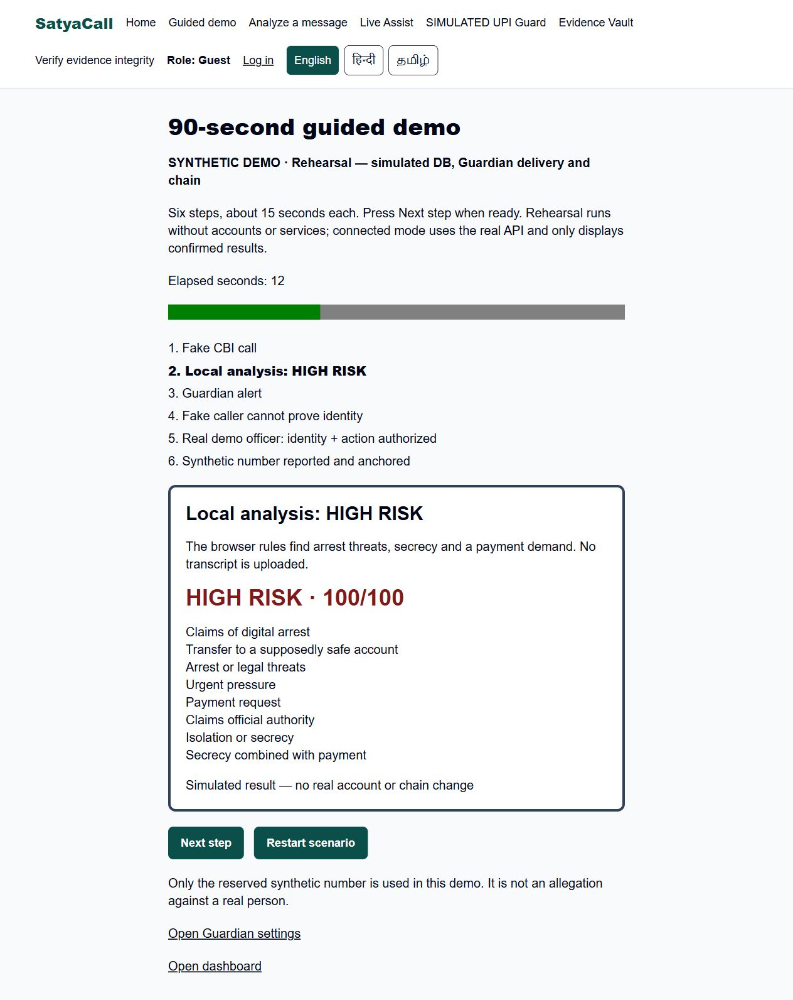

# Security audit — 4 October 2026

Scope: the repository and a local production Next.js build, against AGENTS.md. This is a code and regression audit, not a penetration-test certification or confirmation of a hosted deployment.

| Check | Result and evidence |
| --- | --- |
| Server secrets in client assets | PASS. `rg -l 'SUPABASE_SERVICE_ROLE_KEY\|RELAYER_PRIVATE_KEY\|VERDICT_SIGNING_KEY\|REGISTRY_PEPPER\|RATE_LIMIT_PEPPER' web/.next/static` found no matches. `npm run audit:bundle` additionally checks configured secret values, URL/base64 encodings, and forbidden public-prefixed secret variables. Supabase admin, chain writes and verdict signing use `server-only`. |
| RLS coverage | PASS against all applied migrations in embedded PostgreSQL (PGlite): 17/17 public application tables enable RLS and have explicit policies. Existing integration suites exercise own-row visibility, role escalation rejection, and service-only mutation functions. Anonymous table mutation grants are absent. This does not attest to the state of a hosted Supabase database. |
| Serverless rate limits | PASS. Challenge: 5/minute; verify/analyze/report: 20/minute per scope and account/IP identity. Atomic PostgreSQL UPSERT counters survive independent handler instances and concurrent calls. Required endpoints now count malformed authenticated/anonymous requests before body validation. Invalid/missing DB counters fail closed. No process-memory counter is used. |
| Request validation | PASS. Mutation bodies use strict zod schemas, UUID route parameters are validated, and GET routes validate their query inputs, including strict empty queries. JSON parsing rejects unknown fields, invalid UTF-8/content types and oversized bodies while streaming. Auth callback code and fixed redirect targets are validated. |
| Error disclosure | PASS. API exception boundaries return fixed typed error codes, optional public transaction hashes, and no exception message or stack. Tests inject a secret-bearing exception. Production health rejects debug query inputs without a trace. |
| Headers and CORS | PASS on served production responses. Nonce CSP, `X-Frame-Options: DENY`, `Referrer-Policy: no-referrer`, nosniff, same-origin resource policy and restrictive permissions policy are set. HTTPS responses receive HSTS. Cross-site/same-site API requests and foreign Origin headers are rejected before handlers; preflight returns 405; no permissive Access-Control-Allow-Origin header is emitted. Cookie writes require same-origin evidence. Originless CLI requests remain available for anonymous use. |
| Verification audit | PASS for requests handled while the database is available. Valid, invalid-token, unknown-challenge, replay, expired, exhausted-attempt and rate-blocked attempts are recorded by atomic functions. New rejected-envelope/configuration rows contain only a safe reason and completion timestamp. Every begun attempt gets an initial row before cryptographic/chain checks. Success requires audit completion and receipt persistence before returning. |
| CI | Added `.github/workflows/ci.yml`: Node 24, `npm ci`, web lint/tests/build/client-bundle scan and production HTTP checks; contract typecheck/tests. Permissions are read-only. Build sentinel secrets are synthetic; no hosted secret or deployment access is required. |

## Fixes

- Added nonce CSP and other browser protections; pages render dynamically so nonces are fresh. Production script policy excludes unsafe-inline/unsafe-eval. Inline styles remain permitted for existing layout/QR styles. Verified all 16 scripts on `/demo` carried its response nonce, and the demo hydrated and ran without browser console errors.
- Added API origin/fetch-metadata checks, including the original public Host when Next internally normalizes localhost URLs. This preserves same-origin localhost requests while rejecting other origins.
- Added strict empty-query validation, bounded streaming JSON parsing and generic error handling to previously inputless routes.
- Moved rate counting ahead of validation for the four requested endpoints. Forwarded IPs are trusted only on Vercel or when the operator explicitly enables `RATE_LIMIT_TRUST_PROXY=1` behind a proxy that overwrites the header. Otherwise anonymous clients share an unknown-IP bucket. This conservative default prevents caller-controlled headers from bypassing limits.
- Added `20261004000500_security_audit.sql`, a service-only rejected-verification audit RPC, and regressions for malformed envelopes and missing receipt configuration.
- Added repeatable bundle/HTTP scanners and regression tests for bundle leakage, RLS coverage, atomic limits, origin checks and error redaction.

Nonce/dynamic rendering follows the [Next.js CSP guide](https://nextjs.org/docs/app/guides/content-security-policy). Vercel proxy trust follows its documented [request-header overwrite behavior](https://vercel.com/docs/headers/request-headers). CI uses synthetic values and does not expose live credentials; see [GitHub Actions secrets guidance](https://docs.github.com/en/actions/how-tos/write-workflows/choose-what-workflows-do/use-secrets).

## Validation

- Full final web suite: 252 passed, one optional real-chain integration test skipped (41 test files).
- Contract suite: eight passed. Web lint/typecheck and production build passed.
- HTTP scanner: page 200; 16 matching nonce scripts; fresh nonce; foreign origin 403; same-origin preflight 405; unknown health query 400; static asset headers present.
- Client assets: secret-name grep and configured-value scanner found no leaks. The scanner reports variable labels and filenames, never secret values.

## Remaining deployment checks and limitations

1. Apply the new security-audit migration to the target Supabase project, then run these checks against that deployment. No live database credentials or deployed Vercel URL were available for this audit; hosted policy drift, HTTPS/HSTS, proxy headers and multi-instance rate limits remain unverified there.
2. GitHub Actions is authored but has not run on GitHub. This workspace has no Git metadata, so commits/pushing were not possible. The optional real RPC test is opt-in; Amoy deployment and hosted three-account flows remain separate deployment checks.
3. If the database is unavailable, an audit insert cannot be guaranteed; verification fails closed. If a function is forcibly terminated after beginning a verification, its initial row remains `VERIFICATION_PENDING`; dashboard medians exclude pending rows. Operational reconciliation/retention of interrupted attempts and old rate-limit windows is still needed. Middleware-denied cross-origin requests are perimeter rejections, not DB verification attempts; retain hosting access logs for those.
4. CSP still permits inline styles. Nonce rendering adds dynamic-rendering cost. Browser speech recognition may use cloud processing; UPI interception and demo chain/Guardian steps remain explicitly simulated where applicable.
5. Bundle scans establish absence of known names and configured plaintext/encoded values in emitted assets; they cannot prove absence of every conceivable transformed leak. Keep `server-only` boundaries, deployment secret discipline and scans in CI. Rotate any credentials that were previously exposed outside this repository.
6. Anonymous clients behind an unconfigured proxy intentionally share a restrictive bucket. Configure trusted proxy overwrite behavior before enabling IP differentiation. Multi-user abuse/account farming needs additional production monitoring. Registry hashes of low-entropy identifiers still depend on pepper secrecy and do not eliminate brute-force risk. The testnet relayer remains a single owner; production governance requires a multisig.

## Repeat locally

From `web`: run `npm run lint`, `npm test`, `npm run build`, and `npm run audit:bundle`. For HTTP checks, start the production server on `127.0.0.1:3010`, then run `npm run audit:http` (override with `AUDIT_BASE_URL` for the target deployment). From `contracts`: run `npm run typecheck` and `npm test`. The tests use synthetic data and an embedded DB; they do not send Guardian messages or deploy to Amoy.

